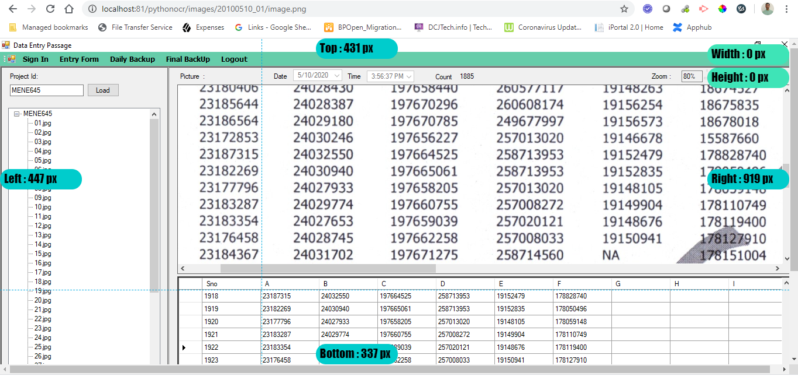
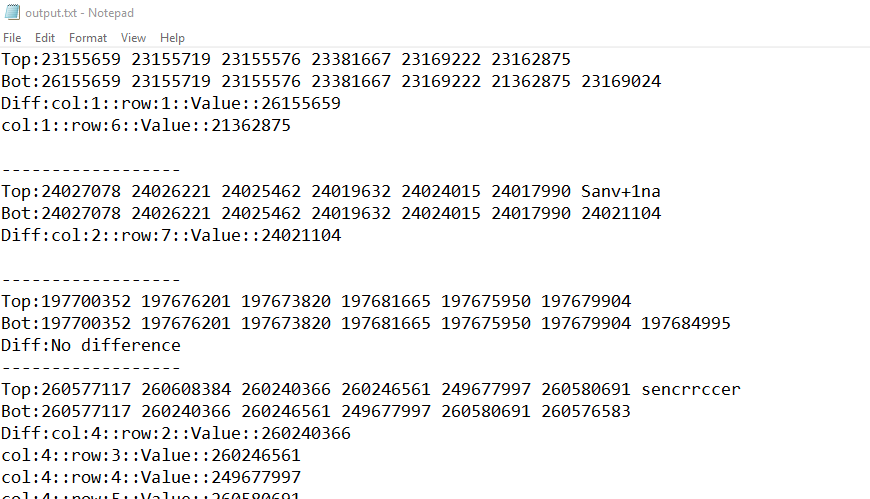

# pythonocr

This program does OCR on a screenshot and validates the bottom set of numbers against a top set of numbers.

## Software needed:

1. Python 3.6 or 3.7 (You can download anaconda and you will get it).
2. You also have the following packages:  
pip install xlrd  
pip install pandas  
pip install pillow  
pip install pytesseract  
pip install opencv-contrib-python-headless  

3. You have to download and install tesseract on your local machine for this to work.
Make sure tesseract is in your path. Default location is:
C:\Users\<userid>\AppData\Local\Tesseract-OCR\tesseract.exe  
Type tesseract -v to get version info.

4. The image_mapping.xlsx file contains the image attributes.
- Place the image to be processed in images directory
- Put one entry in the image mapping spreadsheet.
- You have to put pixel locations for top, left, width and height for the top and bottom portions of the screen.

## How to get the pixel positions of the image:
- Open up chrome browser  
- Install Ruler Chrome Extension  
- Configure a web server (like apache) and add a virtual directory as follows:  
```
 Alias /pythonocr "C:/workspace/python/pythonocr"  
 <Directory "C:/workspace/python/pythonocr">  
    Options Indexes FollowSymLinks Includes  
    AllowOverride All      
    Require all granted  
 </Directory>  
```
Then type http://localhost/pythonocr/images/imagename  
After the image shows up on the browser, you can enable the Ruler add on and it will show pixel info as follows:



### 6. How to run the program:  
<cmd>python image_process.py  
This will open the image_mapping.xlsx spreadsheet and process every image found in the images directory and create sub-directories.
It will write an output into output.txt with the number comparisons.

